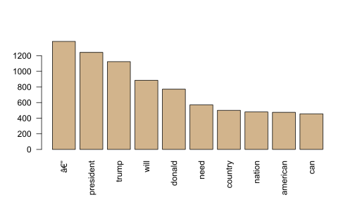
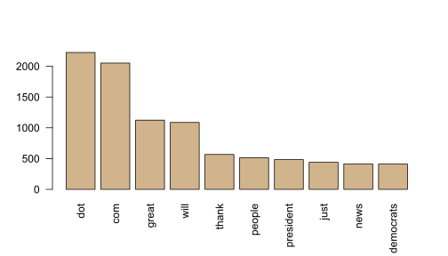

Here are the packages we used in this study:


```r
library(tm)
library(qdap) 
library(wordcloud)
library(viridisLite)
library(plotrix)
library(qdap)
library(tidyverse)
library(tidytext)
library(magrittr)
library(metricsgraphics)
library(ggthemes)
library(dplyr)
library(ggplot2)
library(tibbletime)
library(topicmodels)
library(furrr)
library(stm)
```


---
background-image: url(https://deadline.com/wp-content/uploads/2020/10/Trump-Biden-Twitter.jpg?w=681&h=383&crop=1)

.footnote[
[1] image from AP]

---
class: inverse, center, middle

# We have witnessed tweet wars between two candidates for being the most powerful person in the world.

---
class: inverse, center, middle

# In this analysis, we have traced the patterns of this war. 

---

# Our main tool for this analysis is **R**. It has necessary packages needed for the task.

--

## Here are the types of analysis we made on the data:

--

1. Data Cleaning and Preperation

2. Descriptive Analysis

3. Visualisation - Word Networks

4. Topic Modelling

5. Sentiment Analysis


---
class: inverse, center, middle

# 1. Data Gathering and Preperation

---


We are insterested in past data so because of the twitter API limitations we worked on previously gathered data on [Kaggle.com](https://kaggle.com) downloaded as _.csv_ files.


```r
biden_tw <- read.csv("../archive/JoeBidenTweets.csv")
trump_tw <- read.csv("../archive/realdonaldtrump.csv")
```

--

We have limited the scope of the study to the tweets sent in campain period


```r
biden_cptw <- filter(biden_tw, timestamp >= "2019-04-25 10:00")
trump_cptw <- filter(trump_tw, date >= "2019-06-18 00:10:06")
```


--

There is also necessary cleaning progess we turned into a function called **cleancorpus** 


```r
clean_corpus <- function(corpus){
  corpus <- tm_map(corpus, content_transformer(replace_abbreviation))
  corpus <- tm_map(corpus, removeNumbers)
  corpus <- tm_map(corpus, content_transformer(strip), char.keep="#")
  corpus <- tm_map(corpus, removeWords, c(stopwords("en")))
  corpus <- tm_map(corpus, content_transformer(tolower))
  corpus <- tm_map(corpus, stripWhitespace)
  return(corpus)
}
```

---

The type of analysis needs a special form of text which is called corpus and its transformed matrices. We made some transformations to get that for.

`Import -> Clean -> Filter -> Vectorise -> Corpus -> Term Document Matrix -> Document Term Matrix`

We have used 


```r
biden_tweets <- biden_cptw$tweet
trump_tweets <- trump_cptw$content

# Make a vector source
biden_source <- VectorSource(biden_tweets)
trump_source <- VectorSource(trump_tweets)

biden_corpus <- VCorpus(biden_source)
trump_corpus <- VCorpus(trump_source)

# Create a Term Document Matrix out of our cleaned data and convert it to a Matrix

biden_corpuscl <- clean_corpus(biden_corpus)
trump_corpuscl <- clean_corpus(trump_corpus)

biden_tdm <- TermDocumentMatrix(biden_corpuscl)
trump_tdm <- TermDocumentMatrix(trump_corpuscl)

biden_m <- as.matrix(biden_tdm)
trump_m <- as.matrix(trump_tdm)

biden_dtm <- DocumentTermMatrix(biden_corpuscl)
trump_dtm <- DocumentTermMatrix(trump_corpuscl)

biden_m2 <- as.matrix(biden_dtm)
trump_m2 <- as.matrix(trump_dtm)
```


---

class: inverse, center, middle

# 2. Descriptive Analysis

---

In this first section we made some descriptive analysis before going deep. we calculated polarity score for Biden and Trump.


```r
# Calculate the row sums of biden_m
term_frequency_biden <- rowSums(biden_m)
term_frequency_trump <- rowSums(trump_m)

# Sort term_frequency in decreasing order
term_frequency_biden <- sort(term_frequency_biden, decreasing = TRUE)
term_frequency_trump <- sort(term_frequency_trump, decreasing = TRUE)
```


```r
# Plot a barchart of the 10 most common words
b <- term_frequency_biden[1:10]
barplot(b, col = "tan", las = 2)
```




```r
# Plot a barchart of the 10 most common words
a <- term_frequency_trump[1:10]
barplot(a, col = "tan", las = 2)
```




---

class: inverse, center, middle

# 3. Topic Modelling

---

class: inverse, center, middle

# 4. Sentiment Analysis

---

class: inverse, center, middle

# 5. Visualisation

---

Here, we show 10 most used words by Biden.


---
 
